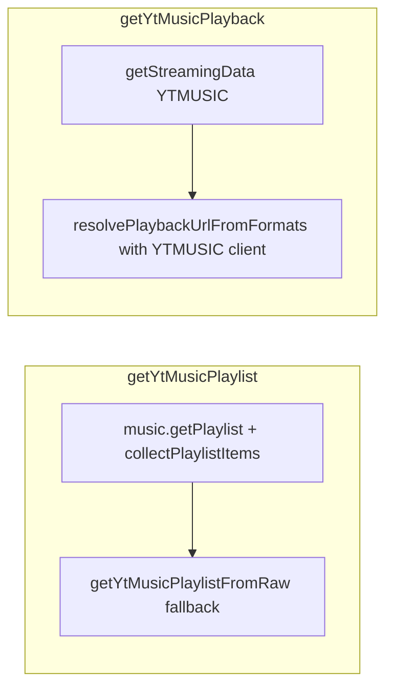

# Innertube-first playback and playlists

## Problem

- `[getYtMusicPlaylist](p:/Projects/winamp-player/src/electron/backend/ytmusic.ts)` currently tries **yt-dlp first**, then `client.music.getPlaylist`. yt-dlp treats `music.youtube.com` as unsupported, redirects to `youtube.com/playlist`, and often returns **“playlist does not exist”** for **account-scoped / YT Music–only** lists—the exact case your app needs.
- `[getYtMusicPlayback](p:/Projects/winamp-player/src/electron/backend/ytmusic.ts)` currently tries **yt-dlp first**, then a manual format loop in `resolvePlaybackUrlFromFormats`. That inverts the product intent: auth + InnerTube should own playback; yt-dlp was a stopgap.

## Target behavior

## Implementation

### 1. Playlists: InnerTube only (in this function)

**File:** `[src/electron/backend/ytmusic.ts](p:/Projects/winamp-player/src/electron/backend/ytmusic.ts)`

- Remove the opening `getYtDlpPlaylistItems` block (lines ~1471–1520) and the `getYtDlpPlaylistItems` import from `./ytDlp` if nothing else in this file needs it.
- Keep the existing flow: `client.music.getPlaylist(playlistId)` → `collectPlaylistItems` → `getYtMusicPlaylistFromRaw` on failure (already there).
- **Rationale:** Private library playlists require the same authenticated `music.youtube.com` InnerTube calls you already use for sync; yt-dlp cannot see them reliably.

### 2. Playback: library API first, YTMUSIC client

**File:** `[src/electron/backend/ytmusic.ts](p:/Projects/winamp-player/src/electron/backend/ytmusic.ts)`

- Remove the `resolveYtDlpPlayback` block from `getYtMusicPlayback` (and drop the import if unused).
- **Primary:** call `client.getStreamingData(videoId, { type: 'audio', quality: 'best' | 'bestefficiency', client: 'YTMUSIC' })` after `getClient()` / `ensurePlayerEvaluator()` (evaluator is already installed in `createClient`).
  - youtubei.js v17 implements this as `getBasicInfo` → `chooseFormat` → `format.decipher(session.player)` (`[Innertube.js` in `node_modules/youtubei.js](p:/Projects/winamp-player/node_modules/youtubei.js/dist/src/Innertube.js)`), which is the supported “give me a deciphered URL” path ([Context7 `/luanrt/youtube.js](https://context7.com/luanrt/youtube.js/llms.txt)` — streaming / YTMUSIC examples).
- **Secondary:** refactor `resolvePlaybackUrlFromFormats` to pass `**client: 'YTMUSIC'`** into `getInfo` / `getBasicInfo` so the watch/player response matches YT Music when the first step fails (e.g. edge formats).
- Map the returned format’s `url` through existing `getCachedAudioUrl(videoId, url)`; keep a reasonable `expiresAt` (parse `expire` from query string when present, else retain the current ~20m fallback).
- **No yt-dlp in this path:** if both steps fail, return `mode: 'unavailable'` with a clear error (same as today). `[ytDlp.ts](p:/Projects/winamp-player/src/electron/backend/ytDlp.ts)` stays available for a **separate** download/export feature later, not wired through `getYtMusicPlayback`.

### 3. Docs / validation

- Re-check [youtubei.js Context7 `/luanrt/youtube.js](https://context7.com/luanrt/youtube.js/llms.txt)` for `download` / `getStreamingData` / `client: 'YTMUSIC'` while implementing (already partially queried).
- Manually verify: open a **library playlist** that previously failed yt-dlp, confirm tracks load; play a track from library and from that playlist; confirm logs no longer show yt-dlp as first resolver for these flows.

## Out of scope (per “don’t overcomplicate”)

- No new settings toggles unless playback regressions appear in testing.
- No large refactors of `collectPlaylistItems` / cache merge logic unless InnerTube-only path exposes a new gap.

