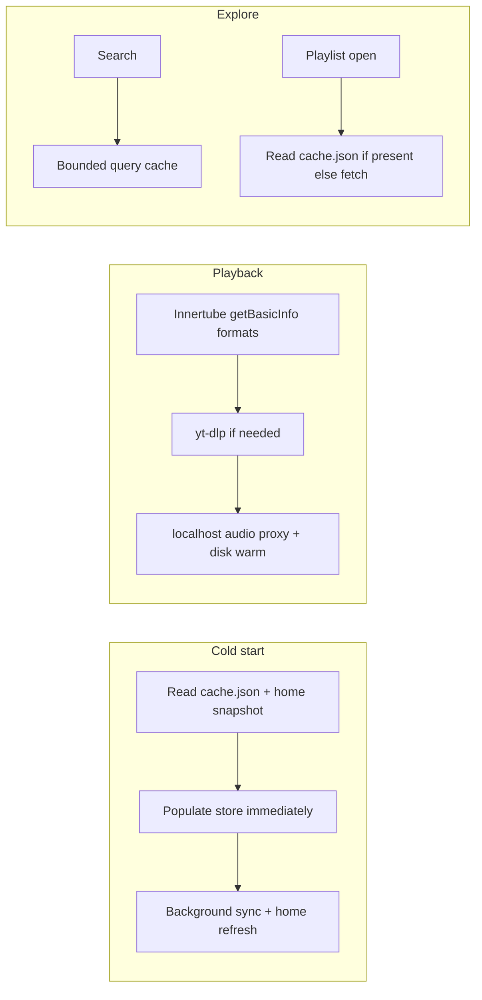

# YT Music playback, data loading, and caching re-architecture

## What you have today (ground truth)

- **Playback** (`[src/electron/backend/ytmusic.ts](p:/Projects/winamp-player/src/electron/backend/ytmusic.ts)`): `getYtMusicPlayback` tries **yt-dlp first**, then `**resolvePlaybackUrlFromFormats`** (`client.getBasicInfo` → `streaming_data.adaptive_formats` / `formats`, decipher via `client.session.player`). URLs are always wrapped through `[getCachedAudioUrl](p:/Projects/winamp-player/src/electron/backend/ytMusicCache.ts)` and fetched via `[audioServer.ts](p:/Projects/winamp-player/src/electron/backend/audioServer.ts)`.
- **Innertube client** is already created with `retrieve_player: true` and a YT Music–aware `fetch` (`[createClient](p:/Projects/winamp-player/src/electron/backend/ytmusic.ts)` ~507–515). So the “POST …/player + WEB_REMIX” idea is largely what **youtubei.js** does under `getBasicInfo`; you do **not** need a hand-rolled POST unless we later bypass the library for debugging or a missing edge case.
- **Library metadata** lives in `**ytmusic/cache.json`** (`tracks`, `playlists`, `lastSyncedAt`), written on sync and on successful playlist open (`upsertCachedPlaylist`). **Media** (audio/art) is separate: `media-index.json` + files under `ytmusic/audio` and `ytmusic/artwork`.
- **Boot** (`[src/mainview/App.tsx](p:/Projects/winamp-player/src/mainview/App.tsx)`): after RPC ready, `loadAuthStatus` → `loadLibrary` → `loadPlaylists` → `**syncYtMusicLibrary`** — the renderer **never** reads `cache.json` first, so remote UI waits on a full network sync every cold start (`[playerStore.syncYtMusicLibrary](p:/Projects/winamp-player/src/mainview/store/playerStore.ts)` ~540–579).
- **Home** (`[getYtMusicHome](p:/Projects/winamp-player/src/electron/backend/ytmusic.ts)` + `[MainWindow.tsx](p:/Projects/winamp-player/src/mainview/MainWindow.tsx)`): network-first; on failure, main falls back to **first 25 library tracks**, not a saved home feed.
- **Search**: live only; no disk cache.
- **Settings** (`[SettingsView.tsx](p:/Projects/winamp-player/src/mainview/components/SettingsView.tsx)`): **media** limit + clear only; stats refresh on mount / after user actions, not continuously. `**clearYtMusicCache`** does **not** remove `cache.json`, so “clear cache” and “library JSON cache” are already conceptually split.

## Additional issues the exploration pass surfaced (worth fixing in scope)

| Issue                                                             | Why it matters                                                                                                                         |
| ----------------------------------------------------------------- | -------------------------------------------------------------------------------------------------------------------------------------- |
| No stale-while-revalidate for library UI                          | Disk already has playlist names + merged tracks; UI ignores it until sync completes.                                                   |
| Home not persisted                                                | Cannot show last-good shelves instantly or offline-ish.                                                                                |
| `expiresAt` from playback largely unused in renderer              | Stale stream URLs can fail until user retries (`[useAudioEngine.ts](p:/Projects/winamp-player/src/mainview/hooks/useAudioEngine.ts)`). |
| Playback errors mostly `console.warn`                             | Poor UX vs explicit toast / retry.                                                                                                     |
| Artwork cache unbounded                                           | Long-term disk growth; should align with settings/limit policy.                                                                        |
| Terminal: `Object has been destroyed` on `loadURL` during sign-in | Separate bug in auth window lifecycle; fix if touching `[loginToYtMusic](p:/Projects/winamp-player/src/electron)` / related handlers.  |

## Target architecture (high level)

## 1. Playback: Innertube-first (your choice)

**Change** `[getYtMusicPlayback](p:/Projects/winamp-player/src/electron/backend/ytmusic.ts)` to:

1. **Try** `resolvePlaybackUrlFromFormats` **first** (requires session — same as today when yt-dlp fails).
2. **On failure or missing streaming data**, call `**resolveYtDlpPlayback`** (current primary).
3. Keep returning `expiresAt`, `loudnessDb`, and `getCachedAudioUrl` wrapping unchanged.

**Follow-ups for UX (same files as today):**

- **Renderer**: In `[useAudioEngine.ts](p:/Projects/winamp-player/src/mainview/hooks/useAudioEngine.ts)`, use `expiresAt` (with a safety margin) to **re-invoke** `ytmusicGetPlayback` before expiry or on `error` / stalled decode, so playback does not depend on a one-shot URL.
- **User feedback**: Surface `mode: "unavailable"` and network errors via existing toast patterns in the main view (minimal wiring from the audio hook or store).

**Risk note:** YouTube can change player responses; yt-dlp as second line keeps AGENTS.md’s safety net. If we see premium-only gaps with `getBasicInfo`, evaluate `**getInfo`** (full) vs Basic in one guarded branch with logging — only if metrics show missing `streaming_data`.

## 2. Metadata loading: stale-while-revalidate on boot

**Backend**

- Add something like `**getYtMusicLibraryFromDisk()`** (or extend an existing internal reader) exposed over IPC as `**ytmusicLoadCachedLibrary`** returning the same shape as sync (or a dedicated `CachedLibraryPayload`: `tracks`, `playlists`, `lastSyncedAt`, optional `cacheVersion`).
- Add **home snapshot** persistence (e.g. `ytmusic/home-snapshot.json` next to `[YTMUSIC_CACHE_PATH](p:/Projects/winamp-player/src/electron/backend/paths.ts)`): written on successful `getYtMusicHome`; read on app start for instant home rows; background refresh overwrites when network succeeds.

**Renderer / store**

- Extend `[playerStore](p:/Projects/winamp-player/src/mainview/store/playerStore.ts)` with `**hydrateYtMusicFromCache()`** (calls new IPC when `auth.loggedIn`).
- Change `[App.tsx](p:/Projects/winamp-player/src/mainview/App.tsx)` init to: `loadAuthStatus` → if YT logged in, `**hydrateYtMusicFromCache` in parallel with** `loadLibrary` / `loadPlaylists` (local files) → `**syncYtMusicLibrary` without blocking first paint** of remote lists (set `syncingRemote: true` but keep showing cached `remoteItems` / tracks).
- Ensure **logout** clears or invalidates in-memory remote data; optionally clear or version-stamp disk cache to avoid showing another account’s playlists (policy decision below).

**Contract**

- Update `[desktop-contract.ts](p:/Projects/winamp-player/src/shared/desktop-contract.ts)`, `[preload.ts](p:/Projects/winamp-player/src/electron/preload.ts)`, and `[main.ts](p:/Projects/winamp-player/src/electron/main.ts)` handler map.

## 3. Playlist open: “instant” when cached

- On navigation to a YT playlist, **before** network: merge from **last-known** `entries` in store (already updated after prior opens). Disk already has this via `upsertCachedPlaylist`; the missing piece is **hydrating the store from disk on boot** (section 2).
- Optional **background hydration**: after boot, low-priority queue to fetch playlists that have empty `trackIds` but exist in sidebar (respect settings: max concurrent, only on Wi-Fi if you add that later). Start with **boot hydrate + on-demand open** only to keep scope tight.

## 4. Search cache

- Add a small **query cache** module (new file under `src/electron/backend/`, e.g. `ytmusicSearchCache.ts`) storing normalized query → `{ results, savedAt }` with **max entries** and **TTL** from settings.
- Hook `[searchYtMusic](p:/Projects/winamp-player/src/electron/backend/ytmusic.ts)` (or the IPC handler in `main.ts`) to read-through cache, then write on success.
- Invalidate or skip cache when auth/session changes (version counter on session load).

## 5. Settings as the “judge” (realtime + policy)

Extend `[settings.ts](p:/Projects/winamp-player/src/electron/backend/settings.ts)` + `[SettingsView.tsx](p:/Projects/winamp-player/src/mainview/components/SettingsView.tsx)` with explicit knobs, for example:

- **Library metadata**: enable / disable using disk cache on startup (default on).
- **Search cache**: enable, TTL (minutes), max entries.
- **Home snapshot**: enable (default on).
- **Clear actions**: separate or grouped — “Clear media cache” (existing), “Clear library & search cache” (new, deletes `cache.json`, home snapshot, search cache file).

**Realtime usage display**

- Either **poll** `getYtMusicCacheStats` while Settings is focused, or add a `**desktop:event`** (extend `[DesktopEventMap](p:/Projects/winamp-player/src/shared/desktop-contract.ts)`) emitted after audio/art writes and limit enforcement so the slider reflects growth without leaving the page. Hybrid (event + slow poll) is robust.

**Artwork cap (gap fill)**

- Mirror audio’s LRU/limit pattern for artwork in `[ytMusicCache.ts](p:/Projects/winamp-player/src/electron/backend/ytMusicCache.ts)` or a shared eviction helper keyed by `updatedAt`, using the same **byte budget** or a split ratio from settings.

## 6. Testing checklist (post-implementation)

- Cold start logged in: playlists/names visible **immediately** from disk; sync spinner then updates lists.
- Home: shows snapshot, then refreshes.
- Open playlist previously opened: tracks **instant** from cache; first-time open still one network round-trip unless background hydration is enabled.
- Search: repeat query hits cache within TTL.
- Playback: Innertube path succeeds for typical tracks; yt-dlp still saves failures; seek/expiry does not dead-end silently.
- Settings: limit change evicts audio; stats update live; clear metadata does not break session.

## Policy choice (default in implementation unless you object)

- On **logout**, **clear in-memory** remote library/home; **keep** `cache.json` on disk for faster re-login but bump a **session id** so stale data is not shown until sync confirms — simplest is to clear `remoteItems` in store and not read disk until `auth.loggedIn` again, while optional “clear library cache on logout” can be a setting.

